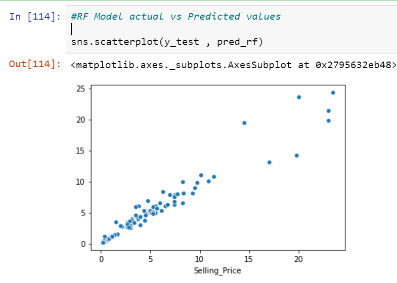

# [Project 1: Car Selling Price Prediction and API Creation for Users/Deployment](https://github.com/Rohan553/Car-Price-Prod_Deployment)
         
   * Created Models predicting the selling Price of Cars based on given inputs by user.
   * Data Collected from Kaggle [Car_Price Dataset](https://www.kaggle.com/nehalbirla/vehicle-dataset-from-cardekho/download).
   * Model trained on almost 300 individual data points(cars) of different Features.
   * Performed Feature extractions from given features like calculating age of car given its year of purchase as input.
   * Analyze the features and represented them visually using python libraries like Matplotlib and Seaborn.
   * Performed One-Hot Encoding on estimators like 'Fuel_Type','Seller_Type', 'Transmission.
   * Performed Linear Regression Model for API creation and Deployment Demo Purpose.
   * Performed Random Forest Regressor as final Model optimizing it through GridSearch CV technique thus obtaining best hyper-parameters and linear trend between predicted        and actual price in the dataset.
   * Designed frontend Client facing HTML form to get inputs from user.
   * Built API using Python Flask application creation and linked it to HTML form.
   * Deployed created application to Heroku Platform as Service on internet.
   * [Heroku Link for the deployed Project](https://id.heroku.com/login) 
      
     **Final Scatterplot of Actual vs Predicted Count**
     
     
# [Project 2: Bike Sharing Project Linear Model](https://github.com/Rohan553/Bike_Sharing-Linear-Regression)
   
   * Created a tool that helps in predicting the number of registered bikes to be hosted at a certain location for rental purpose based on given attributes and monitoring          the available data.
   * Data collected from [UCI Machine Learning DataSource - Bike Sharing](https://archive.ics.uci.edu/ml/datasets/bike+sharing+dataset)
   * Performed EDA to identify the relationships of variables and visually represented the relationship performing different plots and graphs thus identifying if the features      qualifies as a good estimator for Model.
   * Used toold like Matplotlib , Seaborn and Tableau for visual analysis.
   * Freatures like Season , Workingday ,Weather Situation, Temp , Humedity , Windspeed found to be good estimators of registered counts of rental bikes.
   * Perform Dummy Variable/One hot Encoding Feature Engineering Techniques in Categorical Features to get them as inputs for Model.
   * Feature Extraction Used to create new features that adds valuable information and make model more robust using inline built Python Functions.
   * Extraction involves majorly date-time related variables like - hour , month , daynight , peak hour , year from date-time column.
   * Freature transformation technique used (Log Transformation , Polynomial Transformation) for gaining more accuracy and perform trade off.
   * Achived and improved Accuracy from 61% to 88% performing feature transformation techniques.
     
     **Final Scatterplot of Actual vs Predicted Count :** 
       > Before Feature Transformation:  
                      
       > After Feature Transformation:
         
      
 # [Project 2: Credit_Risk Classification Logistic Regression](https://github.com/Rohan553/credit_risk_logistic)
  
  * Created a Logistic based Model that helps in predicting if Loan should be alloted to an individual based on given information and past records.
  * Model Trained on 500 data points after discarding Missing Values.
  * Performed EDA to identify the relationships of variables and visually represented the relationship performing different plots and graphs thus identifying if the features     qualifies as a good estimator for Model.
  * Build custom made Data Cleaning Function Python thus Performing basic feature Engineering and Feature Extraction in one go.
  
  * Performed Logistic Based Classification Modelling with gained accuracy of 81%.
  **Performance Metrices ofthe Model : **
  
   
  
  
  
